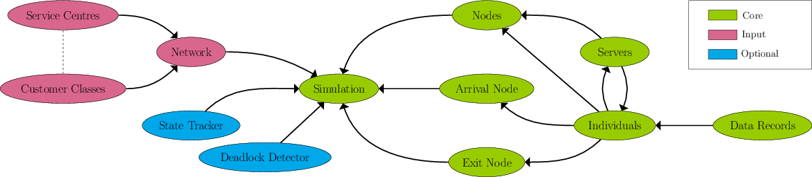

.. _code-structure:

==============
Code Structure
==============

Ciw is structured in an object orientated manor.

Ciw consists of 3 types of objects, Core, Input, and Optional.

Core:

- Simulation
- Arrival Node
- Exit Node
- Node
- Server
- Individual
- Data Record

Input:

- Network
- Service Centre
- Customer Classe

Optional:

- State Tracker
- Deadlock Detector