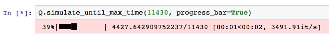

.. _progress-bars:

============
Progress Bar
============

For an individual run of a simulation, Ciw can enable a progress bar to appear. This can help visualise how far through a simulation run currently is. In order to implement this, add the option :code:`progress_bar=True` to the :code:`simulate_until_max_time` method:

    >>> Q.simulate_until_max_time(1500, progress_bar=True) # doctest:+SKIP

The image below shows an example of the output:

