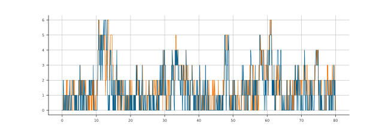

.. _join-shortest-queue:

======================================
How to Set Join-Shortest-Queue Routing
======================================

Ciw has two built-in routing objects that allow two different forms of join-shortest-queue routing logic. Both objects take in a :code:`destinations` argument, which outlines which nodes are possibilities to send the individual to. The forms are:

+ **Join-Shortest-Queue**
  
  Usage: :code:`ciw.routing.JoinShortestQueue(destinations=[1, 3])`

  Individuals are sent to the node, out of it's destinations, with the shortest *queue*. That is, which node has the least number of people waiting for service.

+ **Load Balancing**
  
  Usage: :code:`ciw.routing.LoadBalancing(destinations=[1, 3])`

  Individuals are sent to the node, out of it's destinations, that has the lowest load. That is, which node has the least number of customers present, regardless if the customers are waiting for service or already in service. This can be useful for infinite server systems.

Extensive examples are given below:

- :ref:`example_jsq`
- :ref:`example_lb`

.. _example_jsq:

-----------------------------
Example - Join Shortest Queue
-----------------------------

In this example we will consider a network where customers are routed differently depending on the system state. We will look at a system without this behaviour first, and then the system with the desired behaviour, for comparison.

**Without desired behaviour**

Consider the following three node network, where arrivals only occur at the first node, then customers are randomly routed to either the 2nd or 3rd node before leaving::

    >>> import ciw
    >>> N = ciw.create_network(
    ...     arrival_distributions=[
    ...         ciw.dists.Exponential(rate=10),
    ...         None,
    ...         None],
    ...     service_distributions=[
    ...         ciw.dists.Exponential(rate=25),
    ...         ciw.dists.Exponential(rate=6),
    ...         ciw.dists.Exponential(rate=8)],
    ...     routing=[[0.0, 0.5, 0.5],
    ...              [0.0, 0.0, 0.0],
    ...              [0.0, 0.0, 0.0]],
    ...     number_of_servers=[1, 1, 1]
    ... )

Now we run the system for 80 time units using a state tracker to track the number of customers at Node 1 and Node 2::

    >>> ciw.seed(0)
    >>> Q = ciw.Simulation(N, tracker=ciw.trackers.NodePopulation())
    >>> Q.simulate_until_max_time(80)
    >>> ts = [ts[0] for ts in Q.statetracker.history]
    >>> n2 = [ts[1][1] for ts in Q.statetracker.history]
    >>> n3 = [ts[1][2] for ts in Q.statetracker.history]

Plotting `n2` and `n3` we see that the numbers of customers at each node can diverge greatly::

    >>> import matplotlib.pyplot as plt # doctest:+SKIP
    >>> plt.plot(ts, n2); # doctest:+SKIP
    >>> plt.plot(ts, n3); # doctest:+SKIP

.. image:: ../../_static/custom_routing_without.svg
   :alt: Plot of node populations diverging.
   :align: center

**With desired behaviour**

We will now replace the transition matrix with a network routing object, where the first node routes to the shortest queue out of Nodes 2 and 3, while the other nodes route the customer out of the system::

    >>> N = ciw.create_network(
    ...     arrival_distributions=[
    ...         ciw.dists.Exponential(rate=10),
    ...         None,
    ...         None],
    ...     service_distributions=[
    ...         ciw.dists.Exponential(rate=25),
    ...         ciw.dists.Exponential(rate=6),
    ...         ciw.dists.Exponential(rate=8)],
    ...     routing=ciw.routing.NetworkRouting(
    ...         routers=[
    ...             ciw.routing.JoinShortestQueue(destinations=[2, 3]),
    ...             ciw.routing.Leave(),
    ...             ciw.routing.Leave()
    ...         ]
    ...     ),
    ...     number_of_servers=[1, 1, 1]
    ... )

Now rerun the same system ::

    >>> ciw.seed(0)
    >>> Q = ciw.Simulation(N, tracker=ciw.trackers.NodePopulation())
    >>> Q.simulate_until_max_time(80)
    >>> ts = [ts[0] for ts in Q.statetracker.history]
    >>> n2 = [ts[1][1] for ts in Q.statetracker.history]
    >>> n3 = [ts[1][2] for ts in Q.statetracker.history]

and now plotting `n2` and `n3`, we see that the numbers of customers at each node can follow one another closely, as we are always 'evening out' the nodes' busyness by always filling up the least busy node::

    >>> plt.plot(ts, n2); # doctest:+SKIP
    >>> plt.plot(ts, n3); # doctest:+SKIP

.. _example_lb:

------------------------
Example - Load Balancing
------------------------

In this example we will consider multiple parallel :ref:`processor sharing<processor-sharing>` queues, where customers are routed to the least busy node. Here, because in processor sharing customers do not generally wait, just add to the servers' loads, we will use the Load Balancing routing, rather than the Join Shortest Queue routing.

Consider three independent parallel processor sharing nodes. Customers arrive and are sent to the least busy node.
This can be modelled as a 4 node system: the first node is a dummy node where customers arrive, and routes the customer to one of the thee remaining processor sharing nodes.
If the arrival distribution is Poisson with rate 8, and required service times are exponentially distributed with parameter 10, then our network is::

    >>> import ciw
    >>> N = ciw.create_network(
    ...     arrival_distributions=[ciw.dists.Exponential(rate=8),
    ...                            None,
    ...                            None,
    ...                            None],
    ...     service_distributions=[ciw.dists.Deterministic(value=0),
    ...                            ciw.dists.Exponential(rate=10),
    ...                            ciw.dists.Exponential(rate=10),
    ...                            ciw.dists.Exponential(rate=10)],
    ...     number_of_servers=[float('inf'),
    ...                        float('inf'),
    ...                        float('inf'),
    ...                        float('inf')],
    ...     routing=ciw.routing.NetworkRouting(
    ...         routers=[
    ...             ciw.routing.LoadBalancing(destinations=[2, 3, 4]),
    ...             ciw.routing.Leave(),
    ...             ciw.routing.Leave(),
    ...             ciw.routing.Leave()
    ...         ]
    ...     )
    ... )

For each of the three parallel processor sharing nodes, we can use the :code:`ciw.PSNode` class. The routing decisions are derived from the routing objects, where the first node is given the :code:`LoadBalancing` object, that balances the load in nodes 2, 3 and 4; that is, it sends the individual one of these nodes, whichever currently has the least individuals.

Now let's build a simulation object, where the first node uses the usual :code:`ciw.Node` class, and the others use the built-in :code:`ciw.PSNode` class. We'll also add a state tracker for analysis::

    >>> ciw.seed(0)
    >>> Q = ciw.Simulation(
    ...     N, tracker=ciw.trackers.SystemPopulation(),
    ...     node_class=[ciw.Node, ciw.PSNode, ciw.PSNode, ciw.PSNode])

We'll run this for 100 time units::

    >>> Q.simulate_until_max_time(100)

We can look at the state probabilities, that is, the proportion of time the system spent in each state, where a state represents the number of customers present in the system::

    >>> state_probs = Q.statetracker.state_probabilities(observation_period=(10, 90))
    >>> state_probs
    {1: 0.37895..., 2: 0.13628..., 3: 0.03237..., 0: 0.43600..., 4: 0.01254..., 5: 0.00224..., 6: 0.00108..., 7: 0.00050...}
