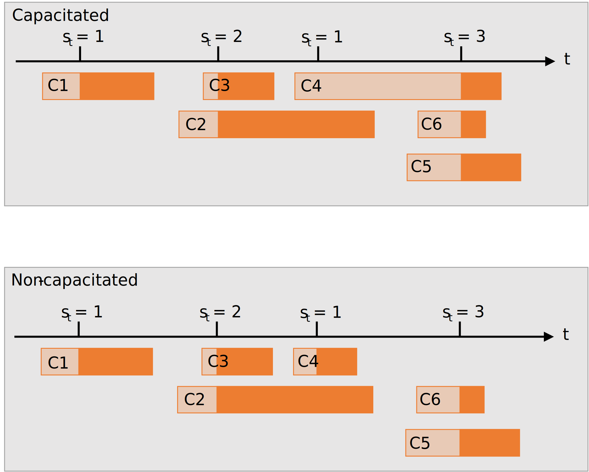

.. _slotted-services:

===========================
How to Set Slotted Services
===========================

Slotted services are a schedule services that happen at specific times, and specific times only. They differ from server schedules, as between the defined 'slots', no services can begin.

They are defined similarly to server schedules. Consider the slotted schedule below:

    +----------------------------+------+------+------+
    |   Slot Times :math:`t`     |  1.5 |  2.3 |  2.8 |
    +----------------------------+------+------+------+
    |   Slot Sizes :math:`s_t`   |    2 |    5 |    3 |
    +----------------------------+------+------+------+

Here 2 customers can be served at time 1.5, 5 can be served at time 2.3, and 3 can be served at time 3. Between these times no services can occur. If customers arrive between two slots, they wait for the next slot. Like server schedules, these repeat, e.g.:

    +----------------------------+------+------+------+------+------+------+------+------+
    |   Slot Times :math:`t`     |  1.5 |  2.3 |  2.8 |  4.3 |  5.1 |  5.6 |  7.1 |  ... |
    +----------------------------+------+------+------+------+------+------+------+------+
    |   Slot Sizes :math:`s_t`   |    2 |    5 |    3 |    2 |    5 |    3 |    2 |  ... |
    +----------------------------+------+------+------+------+------+------+------+------+

In Ciw, they are defined with a :code:`ciw.Slotted` object, like so::

    ciw.Slotted(slots=[1.5, 2.3, 2.8], slot_sizes=[2, 5, 3])

To tell Ciw to use this slotted schedule for a given node, in the :code:`number_of_servers` keyword we replace an integer with the schedule::

    >>> import ciw
    >>> N = ciw.create_network(
    ...     arrival_distributions=[ciw.dists.Exponential(rate=5)],
    ...     service_distributions=[ciw.dists.Deterministic(value=0.2)],
    ...     number_of_servers=[ciw.Slotted(slots=[1.5, 2.3, 2.8], slot_sizes=[2, 5, 3])]
    ... )

Simulating this system, we'll see that services only begin between during the slots::

    >>> ciw.seed(1)
    >>> Q = ciw.Simulation(N)
    >>> Q.simulate_until_max_time(7)
    >>> recs = Q.get_all_records()
    
    >>> set([r.service_start_date for r in recs])
    {1.5, 2.3, 2.8, 4.3, 5.1, 5.6}

Schedule Offsets
----------------

A slotted schedule can be offset by a given amount of time. This means that the cyclic schedule will have a delayed start. This is defined using the :code:`offset` keyword. It's effect can be compared below::

    ciw.Slotted(slots=[1.5, 2.3, 2.8], slot_sizes=[2, 5, 3])

gives:

    +----------------------------+------+------+------+------+------+------+------+------+
    |   Slot Times :math:`t`     |  1.5 |  2.3 |  2.8 |  4.3 |  5.1 |  5.6 |  7.1 |  ... |
    +----------------------------+------+------+------+------+------+------+------+------+
    |   Slot Sizes :math:`s_t`   |    2 |    5 |    3 |    2 |    5 |    3 |    2 |  ... |
    +----------------------------+------+------+------+------+------+------+------+------+

whereas::

    ciw.Slotted(slots=[1.5, 2.3, 2.8], slot_sizes=[2, 5, 3], offset=10.0)

gives:

    +----------------------------+-------+-------+-------+-------+-------+-------+-------+------+
    |   Slot Times :math:`t`     |  11.5 |  12.3 |  12.8 |  14.3 |  15.1 |  15.6 |  17.1 |  ... |
    +----------------------------+-------+-------+-------+-------+-------+-------+-------+------+
    |   Slot Sizes :math:`s_t`   |     2 |     5 |     3 |     2 |     5 |     3 |     2 |  ... |
    +----------------------------+-------+-------+-------+-------+-------+-------+-------+------+

An offset of 10 here delays the beginning of the first slot by 10 time units, and that offset does not appear again in the cyclic schedule. The offset should only be defined as a positive float.

Capacitated & Non-capacitated Slots
-----------------------------------

Slots can be capacitated or non-capacitated. This effects their behaviour when service times last longer than the gaps between slots:

  +  **Capacitated**: At each slot :math:`t`, only :math:`s_t` customers are allowed in service. That means that if any customers are still being served at time :math:`t`, then less than :math:`s_t` customers will begin service, ensuring only :math:`s_t` customers are in service at a time.
  + **Non-capacitated**: At each time slot :math:`t`, :math:`s_t` customers *begin* service, regardless of any pervious customers still being in service.

This is shown visually below:

In order to specify capacitated or non-capacitated slotted schedules, use the keyword :code:`capacitated` when creating the :code:`ciw.Slotted` object. Non-capacitated is the default::

    ciw.Slotted(slots=[1.5, 2.3, 2.8], slot_sizes=[2, 5, 3])  # Non-capacitated
    ciw.Slotted(slots=[1.5, 2.3, 2.8], slot_sizes=[2, 5, 3], capacitated=False)  # Non-capacitated
    ciw.Slotted(slots=[1.5, 2.3, 2.8], slot_sizes=[2, 5, 3], capacitated=True)  # Capacitated

Capacitated slots are subject to :ref:`pre-emption<preemption>`, when a service so long that there is not enough capacity for it to continue being served in the next slot. In this case, the three pre-emption options can be give: :code:`'resume'`, :code:`'restart'`, and :code:`'resample'`, as well as :code:`False` when no pre-emption is required.

