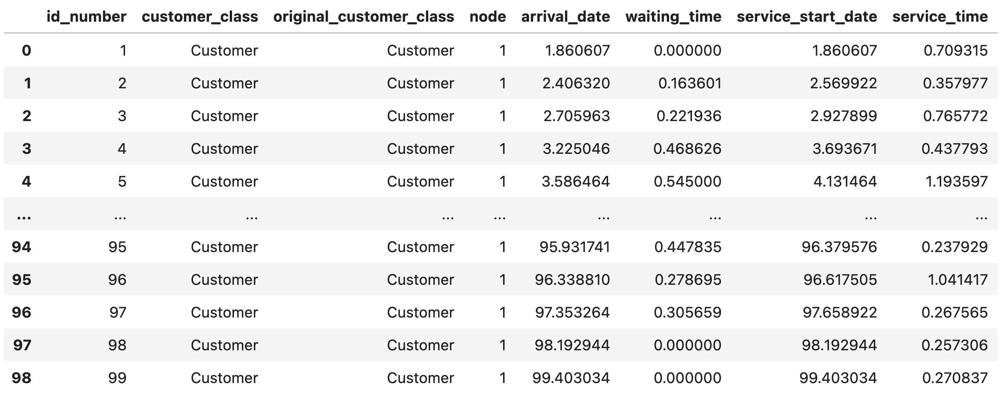

.. _collect-results:

======================
How to Collect Results
======================

Once a simulation has been run, results can be collected. Results take the form of a data record. Certain events in a simulation's run cause data records to be created that describe those events. Those results are:

+ Services
+ :ref:`Pre-empted services<preemption>`
+ :ref:`Baulking customers<baulking-functions>`
+ :ref:`Reneging customers<reneging-customers>`
+ :ref:`Rejected customers<queue-capacities>`

In order to collect all data records, we use the :code:`get_all_records()` method of the Simulation object.

For example, in an M/M/3 queue::

    >>> import ciw
    >>> N = ciw.create_network(
    ...     arrival_distributions=[ciw.dists.Exponential(rate=1)],
    ...     service_distributions=[ciw.dists.Exponential(rate=2)],
    ...     number_of_servers=[1]
    ... )
    >>> ciw.seed(0)
    >>> Q = ciw.Simulation(N)
    >>> Q.simulate_until_max_time(100)

To collect a list of all data records::

    >>> recs = Q.get_all_records()

This gives a list of :code:`DataRecord` objects, which are named tuples with a number of fields with useful information about the event in question::

    >>> r = recs[14]
    >>> r
    Record(id_number=15, customer_class='Customer', original_customer_class='Customer', node=1, arrival_date=16.58266..., waiting_time=0.0, service_start_date=16.58266..., service_time=1.69969..., service_end_date=18.28236..., time_blocked=0.0, exit_date=18.28236..., destination=-1, queue_size_at_arrival=0, queue_size_at_departure=1, server_id=1, record_type='service')

These data records have a number of useful fields, set out in detail :ref:`here<refs-results>`. Importantly, fields can be accessed as attributes::

    >>> r.service_start_date
    16.58266884119802

And so relevant data can be gathered using list comprehension::

    >>> waiting_times = [r.waiting_time for r in recs]
    >>> sum(waiting_times) / len(waiting_times)
    0.3989747...

For easier manipulation, use in conjuction with `Pandas <https://pandas.pydata.org/>`_ is recommended, allowing for easier filtering, grouping, and summary statistics calculations. Lists of data records convert to Pandas data frames smoothly:

    >>> import pandas as pd
    >>> recs_pd = pd.DataFrame(recs)
    >>> recs_pd  # doctest: +SKIP

Types of Records
~~~~~~~~~~~~~~~~

One particular field of note is the :code:`record_type` field, which indicates which of the five events caused that data record to be created.

+ Services: gives :code:`record_type="service"`
+ Pre-empted services gives :code:`record_type="interrupted service"`
+ Baulking customers gives :code:`record_type="baulk"`
+ Reneging customers gives :code:`record_type="renege"`
+ Rejected customers gives :code:`record_type="rejection"`

It is only by understanding the record types that we can understand the other data record fields. More information is given on the relevant Guide pages for each feature.

When a simulation can produce multiple types of data record, it is sometimes useful to be able to only collect data records of a give type or types. we can do this with the optional keyword argument :code:`only`, which takes a list of the record types we are interested in::

    >>> lost_customer_recs = Q.get_all_records(only=["rejection", "baulk", "renege"])
    >>> service_recs = Q.get_all_records(only=["service"])

Incomplete Records
~~~~~~~~~~~~~~~~~~

By default, only *completed* data records are collected. That is, data records where all the recorded information is known, because the recorded information has been completed. That is, for a "service" record, the customer has left the node after service; for the "baulk" record, the customer has left the node after baulking. If the simulation ends with some customers still waiting, still receiving service, or still blocked after service, their incomplete data record is not recorded by default. 

We can collect the incomplete data records using the :code:`include_incomplete` argument when collecting records. This will create an "incomplete" data record, with :code:`None` values representing information not know as it has not been completed yet.

For example consider a D/D/1 queue which ends when a customer is still in service. Compare the collected records when we include and don't include incomplete records::

    >>> import ciw
    >>> N = ciw.create_network(
    ...     arrival_distributions=[ciw.dists.Deterministic(value=5)],
    ...     service_distributions=[ciw.dists.Deterministic(value=4)],
    ...     number_of_servers=[1]
    ... )
    >>> ciw.seed(0)
    >>> Q = ciw.Simulation(N)
    >>> Q.simulate_until_max_time(11)

    >>> ## Completed records only
    >>> recs = Q.get_all_records()
    >>> len(recs)
    1
    >>> recs[0]
    Record(id_number=1, customer_class='Customer', original_customer_class='Customer', node=1, arrival_date=5, waiting_time=0, service_start_date=5, service_time=4, service_end_date=9, time_blocked=0, exit_date=9, destination=-1, queue_size_at_arrival=0, queue_size_at_departure=0, server_id=1, record_type='service')

    >>> ## Including incomplete records
    >>> recs = Q.get_all_records(include_incomplete=True)
    >>> len(recs)
    2
    >>> recs[0]
    Record(id_number=2, customer_class='Customer', original_customer_class='Customer', node=1, arrival_date=10, waiting_time=0, service_start_date=10, service_time=None, service_end_date=None, time_blocked=None, exit_date=None, destination=None, queue_size_at_arrival=0, queue_size_at_departure=None, server_id=False, record_type='incomplete')
    >>> recs[1]
    Record(id_number=1, customer_class='Customer', original_customer_class='Customer', node=1, arrival_date=5, waiting_time=0, service_start_date=5, service_time=4, service_end_date=9, time_blocked=0, exit_date=9, destination=-1, queue_size_at_arrival=0, queue_size_at_departure=0, server_id=1, record_type='service')
