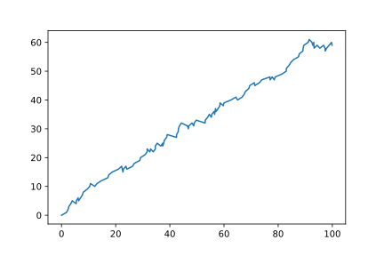
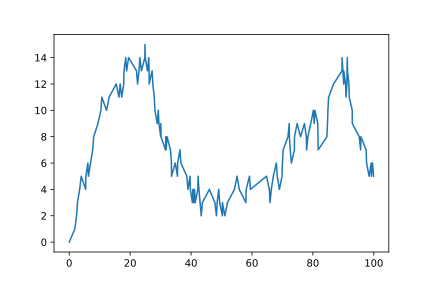

==========================
Variable Number of Servers
==========================

In this example we will consider a network where servers are added and removed depending on the system state. We will look at a system without this behaviour first, and then the system with the desired behaviour, for comparison.

Without desired behaviour
~~~~~~~~~~~~~~~~~~~~~~~~~

Consider an M/M/1 queue with :math:`\Lambda = 1` and :math:`\mu = 0.4`. Here the traffic intensity of the system is greater than one, that is we have customers arriving faster than can be served, and so the queue size will increase over time. Let's see this::

    >>> import ciw

    >>> N = ciw.create_network(
    ...     arrival_distributions=[ciw.dists.Exponential(rate=1)],
    ...     service_distributions=[ciw.dists.Exponential(rate=0.4)],
    ...     number_of_servers=[1]
    ... )
    
    >>> ciw.seed(0)
    >>> Q = ciw.Simulation(N, tracker=ciw.trackers.SystemPopulation())
    >>> Q.simulate_until_max_time(100)

Now let's plot the system population over time::

    >>> plt.plot(
    ...     [row[0] for row in Q.statetracker.history],
    ...     [row[1] for row in Q.statetracker.history]
    ... ); # doctest:+SKIP

With desired behaviour
~~~~~~~~~~~~~~~~~~~~~~

We will now create a :code:`AdaptiveNode` that will add two servers if the population exceeds 10 individuals, and then drop back down to one server if the population drops back down to 3 individuals.
First create the :code:`AdaptiveNode` that inherits from the :code:`ciw.Node` class, and overwrite the :code:`have_event` methods so it first checks the population size and adds / removes servers as needed::

    >>> class AdaptiveNode(ciw.Node):
    ...     def have_event(self):
    ...         if (len(self.all_individuals) > 10) and (len(self.servers) == 1):
    ...             print(f'Adding servers at {self.get_now():.3f}')
    ...             self.add_new_servers(2)
    ...         elif (len(self.all_individuals) < 4) and (len([s for s in self.servers if not s.offduty]) == 3):
    ...             print(f'Removing servers at {self.get_now():.3f}')
    ...             self.take_servers_off_duty()
    ...             self.add_new_servers(1)
    ...         super().have_event()

Here print statements have also been added to record when the changes in the numbers of servers occur.

Now rerun the same system, telling Ciw to use the new :code:`node_class`.
We'll still begin with just one server::

    >>> ciw.seed(0)
    >>> Q = ciw.Simulation(N, node_class=AdaptiveNode, tracker=ciw.trackers.SystemPopulation())
    >>> Q.simulate_until_max_time(100)
    Adding servers at 12.279
    Removing servers at 43.344
    Adding servers at 89.848

Now let's plot the system population over time::

    >>> plt.plot(
    ...     [row[0] for row in Q.statetracker.history],
    ...     [row[1] for row in Q.statetracker.history]
    ... ); # doctest:+SKIP

We see the system population is now better under control.
Furthermore, large changes in the system population tends occur at the times where servers were added and removed.
