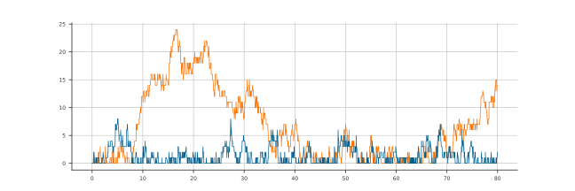
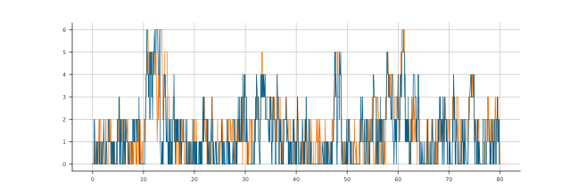

State-dependent Routing
=======================

In this example we will consider a network where customers are routed differently depending on the system state. We will look at a system without this behaviour first, and then the system with the desired behaviour, for comparison.

Without desired behaviour
~~~~~~~~~~~~~~~~~~~~~~~~~

Consider the following three node network, where arrivals only occur at the first node, then customers are randomly routed to either the 2nd or 3rd node before leaving::

    >>> import ciw

    >>> N = ciw.create_network(
    ...     arrival_distributions=[
    ...         ciw.dists.Exponential(rate=10),
    ...         ciw.dists.NoArrivals(),
    ...         ciw.dists.NoArrivals()],
    ...     service_distributions=[
    ...         ciw.dists.Exponential(rate=25),
    ...         ciw.dists.Exponential(rate=6),
    ...         ciw.dists.Exponential(rate=8)],
    ...     routing=[[0.0, 0.5, 0.5],
    ...              [0.0, 0.0, 0.0],
    ...              [0.0, 0.0, 0.0]],
    ...     number_of_servers=[1, 1, 1]
    ... )

Now we run the system for 80 time units using a state tracker to track the number of customers at Node 1 and Node 2::

    >>> ciw.seed(0)
    >>> Q = ciw.Simulation(N, tracker=ciw.trackers.NodePopulation())
    >>> Q.simulate_until_max_time(80)
    
    >>> ts = [ts[0] for ts in Q.statetracker.history]
    >>> n2 = [ts[1][1] for ts in Q.statetracker.history]
    >>> n3 = [ts[1][2] for ts in Q.statetracker.history]

Plotting `n2` and `n3` we see that the numbers of customers at each node can diverge greatly::

    >>> import matplotlib.pyplot as plt # doctest:+SKIP
    >>> plt.plot(ts, n2); # doctest:+SKIP
    >>> plt.plot(ts, n3); # doctest:+SKIP

With desired behaviour
~~~~~~~~~~~~~~~~~~~~~~

We will now create a new :code:`CustomRouting` for Node 1, that will send its customers to the least busy of Nodes 2 and 3.
First create the :code:`CustomRouting` that inherits from :code:`ciw.Node`, and overwrites the :code:`next_node` method::

    >>> class CustomRouting(ciw.Node):
    ...     """
    ...     Chooses either Node 2 or Node 3 as the destination node,
    ...     whichever has the least customers. Chooses randomly in
    ...     the event of a tie.
    ...     """
    ...     def next_node(self, ind):
    ...         n2 = self.simulation.nodes[2].number_of_individuals
    ...         n3 = self.simulation.nodes[3].number_of_individuals
    ...         if n2 < n3:
    ...             return self.simulation.nodes[2]
    ...         elif n3 < n2:
    ...             return self.simulation.nodes[3]
    ...         return ciw.random_choice([self.simulation.nodes[2], self.simulation.nodes[3]])

Now rerun the same system, using the same network object :code:`N` (notice the transition matrix will be unused now).
We tell Ciw which node class to use for each node of the network, by giving the :code:`node_class` argumument a list of classes.
We'll use the new :code:`CustomRouting` class for Node 1, and the regular :code:`ciw.Node` class for Nodes 2 and 3::

    >>> ciw.seed(0)
    >>> Q = ciw.Simulation(
    ...     N, tracker=ciw.trackers.NodePopulation(),
    ...     node_class=[CustomRouting, ciw.Node, ciw.Node])
    >>> Q.simulate_until_max_time(80)
    
    >>> ts = [ts[0] for ts in Q.statetracker.history]
    >>> n2 = [ts[1][1] for ts in Q.statetracker.history]
    >>> n3 = [ts[1][2] for ts in Q.statetracker.history]

Plotting `n2` and `n3` now, we see that the numbers of customers at each node can follow one another closely, as we are always 'evening out' the nodes' busyness by always filling up the least busy node::

    >>> plt.plot(ts, n2); # doctest:+SKIP
    >>> plt.plot(ts, n3); # doctest:+SKIP

