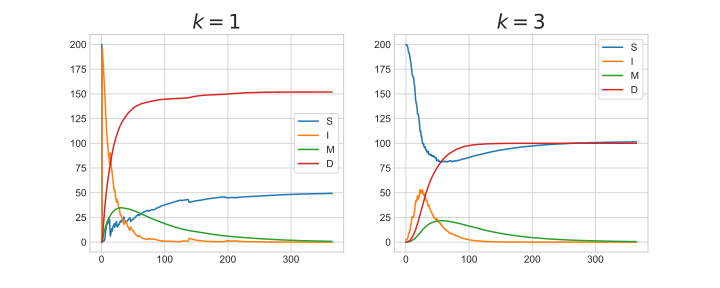

DES+SD Hybrid Simulation with Ciw
=================================

In the paper [GP21]_ a DES+SD hybrid simulation is defined using Ciw and Scipy. This is achieved by defining new :code:`Simulation` and :code:`Node` objects that solve a set of differential equations that update parameters of the DES continuously. We give an example here.

Consider a supermarket modelled as an :math:`M/M/k` queue, whose customers are living in an SIMD disease model. This is show below:

Here:

+ :math:`S` is the number of people in the population susceptible to the disease,
+ :math:`I` is the number of people in the population infected with the disease,
+ :math:`M` is the number of people in the population temporarily immune from the disease,
+ :math:`D` is the number of people dead from the disease,
+ :math:`\alpha` is the infection rate,
+ :math:`\beta` is the proportion of infected people who still go to the supermarket,
+ :math:`\gamma` is the frequency people go to the supermarket,
+ :math:`f` is the fatality rate of the disease,
+ :math:`r` is the recovery rate of the disease,
+ :math:`p` is the probability of gaining immunity from the disease,
+ :math:`\tau` is the rate at which people lose immunity,
+ :math:`c` is the contact rate when people are in the supermarket,
+ :math:`\Lambda` is the arrival rate to the supermarket,
+ :math:`\mu` is the rate at which people are served the supermarket,
+ :math:`L` is the number of people in the supermarket.

The SIMD system is defined by the following set of differential equations:

.. math::
    \begin{align}
    \frac{dS}{dt} &= -\frac{SI\alpha\beta c}{S + \beta I + M} + \left(1 - p\right)rI + \tau M \label{eqn:desinsd_eqn1}\\
    \frac{dI}{dt} &= \frac{SI\alpha\beta c}{S + \beta I + M} + \left(r + f\right)I \label{eqn:desinsd_eqn2}\\
    \frac{dM}{dt} &= prI - \tau M \label{eqn:desinsd_eqn3}\\
    \frac{dD}{dt} &= fI \label{eqn:desinsd_eqn4}
    \end{align}

And these interact with the queueing system by:

.. math::
    \begin{align}
    c &= \gamma \max(L - 1, 0)\\
    \Lambda &= \gamma\left(S + \beta I + M\right)
    \end{align}

The differential equations can be solved using Scipy. Let's define an SD component::

    from scipy.integrate import odeint
    import numpy as np
    
    class SD():
        def __init__(self, S, I, M, D, visits_per_day, prop_shop, infection_rate,
                     recovery_rate, prop_immune, rate_lose_immune, death_rate, **kwargs):
            self.S = [S]
            self.I = [I]
            self.M = [M]
            self.D = [D]
            self.visits_per_day = visits_per_day
            self.prop_shop = prop_shop
            self.infection_rate = infection_rate
            self.recovery_rate = recovery_rate
            self.prop_immune = prop_immune
            self.rate_lose_immune = rate_lose_immune
            self.death_rate = death_rate
            self.time = np.array([0])
        
        def differential_equations(self, y, time_domain, L):
            contact_rate = self.visits_per_day * max(L - 1, 0)
            S, I, M, D = y
            N = S + I + M
            dSdt = (-(S * I * self.prop_shop * contact_rate * self.infection_rate) / (S + (self.prop_shop * I) + M)) + ((1 -     self.prop_immune) * self.recovery_rate * I) + (self.rate_lose_immune * M)
            dIdt = ((S * self.prop_shop * I * contact_rate * self.infection_rate) / (S + (self.prop_shop * I) + M)) - ((self.recovery_rate + self.death_rate) * I)
            dMdt = ((self.prop_immune * self.recovery_rate) * I) - (self.rate_lose_immune * M)
            dDdt = self.death_rate * I
            return dSdt, dIdt, dMdt, dDdt
    
        def solve(self, t, **kwargs):
            L = kwargs['L']
            y0 = (self.S[-1], self.I[-1], self.M[-1], self.D[-1])
            relevant = (self.time_domain <= t) & (self.time_domain >= self.time[-1])
            times_between_events = np.concatenate((np.array([self.time[-1]]), self.time_domain[relevant], np.array([t])),     axis=None)
            results = odeint(self.differential_equations, y0, times_between_events, args = (L,))
            S, I, M, D = results.T
            self.S = np.append(self.S, S)
            self.I = np.append(self.I, I)
            self.M = np.append(self.M, M)
            self.D = np.append(self.D, D)
            self.time = np.append(self.time, times_between_events)

This component can be attached to a custom :code:`Simulation` object, and can be set to run at any time. Then simulation parameters can be read and updated by looking at this component.

We would like to solve the SD component whenever the time moves onwards in the discrete event simulation, that is whenever there is an arrival or whenever a customer leaves the supermarket. The arrival rates need information from the SD component, and the SD component needs information about the number of customers that are present at any time.

Therefore, to link the SD component and the discrete event simulation, we will make a :code:`HybridSimulation` that has the SD component as an attribute; we will make a :code:`HybridNode` that triggers the SD solve whenever a customer is released; and we will define a customer arrival distribution :code:`SolveSDArrivals` which will trigger the SD solve and read information from this to sample a new arrival time::

    import ciw

    class HybridNode(ciw.Node):
        def release(self, next_individual_index, next_node):
            super().release(next_individual_index, next_node)
            self.simulation.SD.solve(t=self.get_now(), L=self.number_of_individuals)
    
    
    class HybridSimulation(ciw.Simulation):
        def __init__(self, network, **kwargs):
            self.SD = SD(**kwargs)
            super().__init__(network=network, node_class=HybridNode)
        
        def simulate_until_max_time(self, max_simulation_time, n_steps):
            self.SD.time_domain = np.linspace(0, max_simulation_time, n_steps)
            super().simulate_until_max_time(max_simulation_time)
            self.SD.solve(t=max_simulation_time, L=self.nodes[1].number_of_individuals)
    
    
    class SolveSDArrivals(ciw.dists.Distribution):            
        def sample(self, t=None, ind=None):
            if t != 0:
                L = self.simulation.nodes[1].number_of_individuals
                self.simulation.SD.solve(t, L=L)
            able_to_shop = self.simulation.SD.S[-1] + self.simulation.SD.M[-1] + (self.simulation.SD.prop_shop * self.simulation.SD.I[-1])
            rate = self.simulation.SD.visits_per_day * able_to_shop
            return ciw.dists.Exponential(rate).sample()

Now a function can be written that will run one trial of this hybrid simulation. The KPIs of interest here will be the stock levels of :math:`S`, :math:`I`, :math:`M` and :math:`D` over time. A number of parameters will be fixed, but we will allow changes to the number of servers::

    def run_trial(trial, number_servers):
        results = {}
        
        N = ciw.create_network(
            arrival_distributions=[SolveSDArrivals()],
            service_distributions=[ciw.dists.Exponential(48)],
            number_of_servers=[number_servers])
        
        ciw.seed(trial)
        
        Q = HybridSimulation(
            network=N,
            S=200, I=2, M=0, D=0,
            visits_per_day=1/2,
            prop_shop=1/3,
            infection_rate=1,
            recovery_rate=1/14,
            prop_immune=1/4,
            rate_lose_immune=1/75,
            death_rate=1/21)
        
        Q.simulate_until_max_time(365, 50000)
        
        results['t'] = Q.SD.time
        results['S'] = Q.SD.S
        results['I'] = Q.SD.I
        results['M'] = Q.SD.M
        results['D'] = Q.SD.D
        return results

Running these for one trial only (this is bad practice, :ref:`see here <simulation-practice>`), we can plot the stock levels over time. We see that changing the number of servers from :math:`k = 1` to :math:`k = 3`, a parameter associated with the discrete component, changes the stock levels, results associated with the continuous component.

