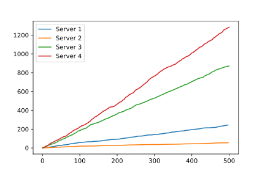

Server-dependent Services
=========================

In this example we will consider a service centre where each server has its own unique service rate.
We will model a shop with four servers, each server gains commission from their sales, and so we need to record the number of customers each server serves. Each server works at a different speed.
We will look at a system without this behaviour first, and then the system with the desired behaviour, for comparison.

Without desired behaviour
~~~~~~~~~~~~~~~~~~~~~~~~~
We need to first define a way to record when each server serves their customers. We can do this with a custom Distribution object. We will define :code:`Exponential_CountCusts` that gives and updates each server's :code:`served_inds` attribute, which has the time points that they begin service with each individual::

    >>> import ciw
    >>> class Exponential_CountCusts(ciw.dists.Exponential):
    ...     def sample(self, t=None, ind=None):
    ...         n = ind.server.id_number
    ...         if hasattr(ind.server, "served_inds"):
    ...             ind.server.served_inds.append(self.simulation.current_time)
    ...         else:
    ...             ind.server.served_inds = [self.simulation.current_time]
    ...         return super().sample()

Now consider an M/M/4 queue with :math:`\Lambda = 2` and :math:`\mu = 0.5`::

    >>> N = ciw.create_network(
    ...     arrival_distributions=[ciw.dists.Exponential(rate=5.0)],
    ...     service_distributions=[Exponential_CountCusts(rate=0.5)],
    ...     number_of_servers=[4],
    ... )

    >>> ciw.seed(0)
    >>> Q = ciw.Simulation(N)
    >>> Q.simulate_until_max_time(500)

For each server we can plot their cumulative count of individuals served over time, seeing that the rate at which the servers gain their commission are all equal::

    >>> for s in Q.nodes[1].servers:
    ...     plt.plot(
    ...         [0] + [t for t in s.served_inds],
    ...         [0] + [i + 1 for i, t in enumerate(s.served_inds)],
    ...     label=f"Server {s.id_number}") # doctest:+SKIP
    >>>     plt.legend() # doctest:+SKIP

.. image:: ../../_static/server_dependent_dist_without.svg
   :alt: Plot server commission over time, all with the same behaviour.
   :align: center

With desired behaviour
~~~~~~~~~~~~~~~~~~~~~~

We now want each of the servers to serve at a different rate.
Will now create a :code:`Dependent_CountCusts` class that allows us to use different service rates for each server.
In addition to counting the number of served individuals, this will identify the current server (:code:`ind.server`) by their ID number, and use a :code:`rates` dictionary to map server IDs to service rates::

    >>> import random
    >>> class Dependent_CountCusts(ciw.dists.Exponential):
    ...     def __init__(self, rates):
    ...         self.rates = rates
    ...     
    ...     def sample(self, t=None, ind=None):
    ...         n = ind.server.id_number
    ...         if hasattr(ind.server, "served_inds"):
    ...             ind.server.served_inds.append(self.simulation.current_time)
    ...         else:
    ...             ind.server.served_inds = [self.simulation.current_time]
    ...         r = self.rates[ind.server.id_number]
    ...         return random.expovariate(r)

Now let's define the service rate for each of the servers:
    + server 1 serves with rate `0.5`,
    + server 2 serves with rate `0.1`,
    + server 3 serves with rate `2`,
    + server 4 serves with rate `3`.

Now rerun the same system, telling Ciw to use the new :code:`Dependent_CountCusts` for the service distributions with the given rates dictionary::

    >>> rates = {1: 0.5, 2: 0.1, 3: 2, 4: 3}
    >>> N = ciw.create_network(
    ...     arrival_distributions=[ciw.dists.Exponential(rate=5.0)],
    ...     service_distributions=[Dependent_CountCusts(rates=rates)],
    ...     number_of_servers=[4],
    ... )

    >>> ciw.seed(0)
    >>> Q = ciw.Simulation(N)
    >>> Q.simulate_until_max_time(500)

Plotting the cumulative counts for each server population over time::

    >>> for s in Q.nodes[1].servers:
    ...     plt.plot(
    ...         [0] + [t for t in s.served_inds],
    ...         [0] + [i + 1 for i, t in enumerate(s.served_inds)],
    ...     label=f"Server {s.id_number}") # doctest:+SKIP
    >>>     plt.legend() # doctest:+SKIP

We now see that each of the servers has a different rate at which they gain commission.

