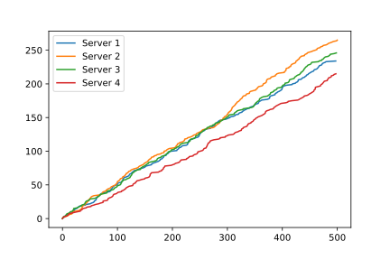

Server-dependent service rate
=============================

In this example we will consider a network where each server has its own unique service rate.
We will look at a system without this behaviour first, and then the system with the desired behaviour, for comparison.

Without desired behaviour
~~~~~~~~~~~~~~~~~~~~~~~~~

Consider an M/M/4 queue with :math:`\Lambda = 2` and :math:`\mu = 0.2`. 
Here the traffic intensity of the system is greater than one, that is we have customers arriving faster than can be served, and so the queue size will increase over time. Let's see this::

    >>> import ciw
    >>> N = ciw.create_network(
    ...     arrival_distributions=[ciw.dists.Exponential(rate=2.0)],
    ...     service_distributions=[ciw.dists.Exponential(rate=0.2)],
    ...     number_of_servers=[4],
    ... )

    >>> ciw.seed(0)
    >>> Q = ciw.Simulation(N, tracker=ciw.trackers.SystemPopulation())
    >>> Q.simulate_until_max_time(100)

Now let's plot the system population over time::

    >>> import matplotlib.pyplot as plt
    >>> plt.plot(
    ...     [row[0] for row in Q.statetracker.history],
    ...     [row[1] for row in Q.statetracker.history]
    ... ); # doctest:+SKIP

With desired behaviour
~~~~~~~~~~~~~~~~~~~~~~

We will now create a :code:`ServerDependentDist` class that allows us to use different service rates for each server.
First create the :code:`ServerDependentDist` that inherits from :code:`ciw.dists.Distribution` class, and overwrites the :code:`__init__` method and the :code:`sample` method. 
The :code:`__init__` method takes a dictionary with keys being the server id and values being the service rates. 
The :code:`sample` method returns a random number from the exponential distribution with parameter that corresposnds to the server that is currently in use.
The concerned individual :code:`ind` can be used to get the server that the individual is assigned to. 
Using :code:`ind.server.id_number` we can get the id number of that server.
As an additional step a new attribute is attached to each server that keeps track of how many individuals each server has served::

    >>> import random
    >>> class ServerDependentDist(ciw.dists.Distribution):
    ...     def __init__(self, rates):
    ...         self.rates = rates
    ...
    ...     def sample(self, t=None, ind=None):
    ...         n = ind.server.id_number
    ...         rate = self.rates[n]
    ...         if hasattr(ind.server, "served_inds"):
    ...             ind.server.served_inds += 1
    ...         else:
    ...             ind.server.served_inds = 1
    ...         return random.expovariate(rate)

From the previous example, let us assume that 2 of the 4 servers have been upgraded to faster models and define a server dependent distribution that returns:
    + :code:`0.2` if the server id number is 1,
    + :code:`0.2` if the server id number is 2,
    + :code:`1` if the server id number is 3,
    + :code:`1` if the server id number is 4

Now rerun the same system, telling Ciw to use the new :code:`ServerDependentDist` for the service distributions::

    >>> rates = {1: 0.2, 2: 0.2, 3: 1, 4: 1}
    >>> N = ciw.create_network(
    ...     arrival_distributions=[ciw.dists.Exponential(rate=2.0)],
    ...     service_distributions=[ServerDependentDist(rates=rates)],
    ...     number_of_servers=[4]
    ... )

    >>> ciw.seed(0)
    >>> Q = ciw.Simulation(N, tracker=ciw.trackers.SystemPopulation())
    >>> Q.simulate_until_max_time(100)

Now let's plot the system population over time::

    >>> import matplotlib.pyplot as plt
    >>> plt.plot(
    ...     [row[0] for row in Q.statetracker.history],
    ...     [row[1] for row in Q.statetracker.history]
    ... ); # doctest:+SKIP

We see the system population is now better under control. 
Furthermore, by looking at the number of individuals served by each server we can see that the two faster servers have been serving more individuals than the other two::

    >>> for s in Q.nodes[1].servers:
    ...     print(f"Server {s.id_number}: {s.served_inds} served.")
    Server 1: 21 served
    Server 2: 21 served
    Server 3: 73 served
    Server 4: 76 served
