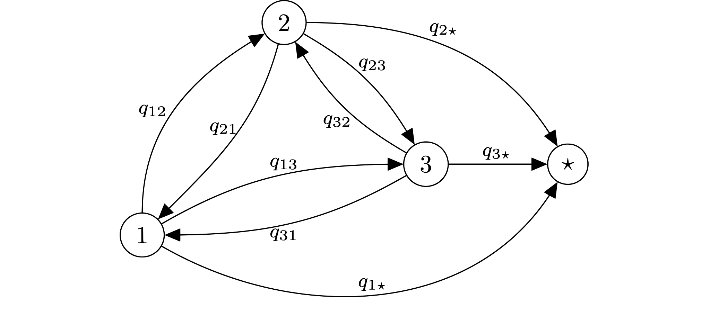
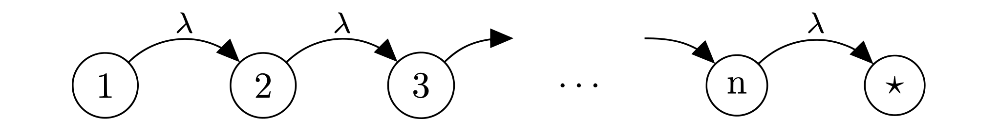
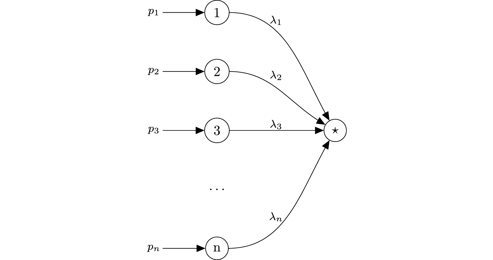
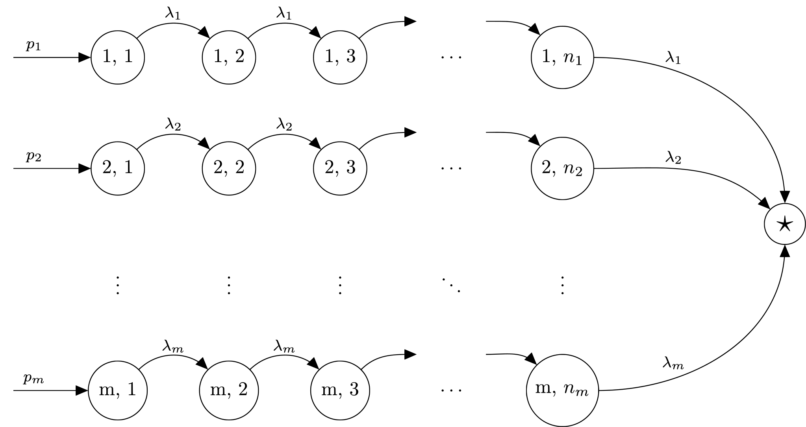
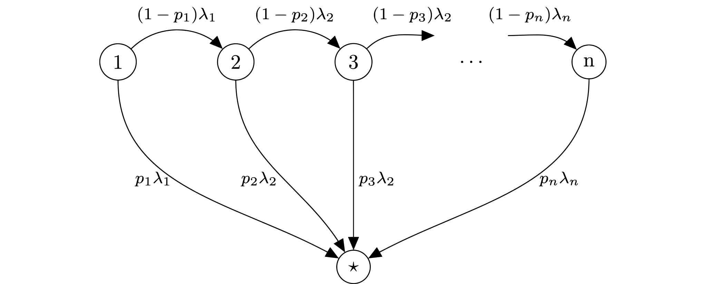

.. _phase-type:

===================================
How to Set Phase-Type Distributions
===================================

One particular subset of distributions offered by Ciw is Phase-Type distributions.
These are very useful and versatile family of distributions defined by absorbing Markov chains.
That is, given a probability vector :math:`\alpha` representing the probability of the starting state, and an transition rate matrix :math:`M` of an absorbing Markov chain, these are distributions given by the time to absorption.
It is therefore a random sum of exponential variables.

The diagram below gives a general representation of an absorbing Markov chain with four states, 1, 2, 3, and the absorbing state :math:`\star`:

The corresponding Phase-Type distribution would be defined by an initial state probability vector:

.. math::
    \alpha = \left(p_1, p_2, p_3, 0\right)

and the transition matrix corresponding to the absorbing Markov chain:

.. math::
    M = \begin{pmatrix}
    -\sum_{i \neq 1} q_{1i} & q_{12} & q_{13} & q_{14} \\
    q_{21} & -\sum_{i \neq 2} q_{2i} & q_{23} & q_{24} \\
    q_{31} & q_{32} & -\sum_{i \neq 3} q_{3i} & q_{34} \\
    0 & 0 & 0 & 0
    \end{pmatrix}

An example of implementing this in Ciw::

    >>> import ciw
    >>> initial_state = [0.7, 0.2, 0.1, 0.0]
    >>> absorbing_matrix = [
    ...     [-6, 2, 0, 4],
    ...     [0, -3, 3, 0],
    ...     [1, 0, -5, 4],
    ...     [0, 0, 0, 0]
    ... ]
    >>> Ph = ciw.dists.PhaseType(initial_state, absorbing_matrix)

Phase-Type distributions are a large family of distributions.
Some Phase-Type distributions that have particular structures to their underlying absorbing Markov chain can be particularly useful, and Ciw offers helper classes for some of these to build the transition matrix for you. They are outlined below.

Erlang Distributions
--------------------

An Erlang distribution with parameters :math:`\lambda` and :math:`n` is the sum of :math:`n` Exponential distributions with parameter :math:`\lambda`. This can be equivalently defined as the Phase-Type distribution with the following structure:

The corresponding Phase-Type distribution would be defined by an initial state probability vector:

.. math::
    \alpha = \left(1, 0, \dots, 0\right)

and the transition matrix:

.. math::
    M = \begin{pmatrix}
    -\lambda & \lambda & 0 & \dots & 0 & 0 \\
    0 & -\lambda & \lambda & \dots & 0 & 0 \\
    0 & 0 & -\lambda & \dots & 0 & 0 \\
    \vdots & \vdots & \vdots & \dots & \vdots & \vdots \\
    0 & 0 & 0 & \dots & -\lambda & \lambda \\
    0 & 0 & 0 & \dots & 0 & 0 \\
    \end{pmatrix}

Rather than define these, in Ciw we can create an Erlang distribution from the parameters :math:`\lambda` and :math:`n`::

    >>> Er = ciw.dists.Erlang(rate=9, num_phases=4)

HyperExponential Distributions
------------------------------

An HyperExponential distribution is defined by a probability vector :math:`\mathbf{p}` and rate vector :math:`\mathbf{\lambda}`, and samples an Exponential distribution with parameter :math:`\lambda_i` with probability :math:`p_i`. This can be equivalently defined as the Phase-Type distribution with the following structure:

When :math:`\mathbf{p} = \left(p_1, p_2, \dots, p_n\right)` and :math:`\mathbf{\lambda} = \left(\lambda_1, \lambda_2, \dots, \lambda_n\right)` the corresponding Phase-Type distribution would be defined by an initial state probability vector:

.. math::
    \alpha = \left(p_1, p_2, \dots, p_n, 0\right)

and the transition matrix:

.. math::
    M = \begin{pmatrix}
    -\lambda_1 & 0 & 0 & \dots & 0 & \lambda_1 \\
    0 & -\lambda_2 & 0 & \dots & 0 & \lambda_2 \\
    0 & 0 & -\lambda_3 & \dots & 0 & \lambda_3 \\
    \vdots & \vdots & \vdots & \ddots & 0 & \vdots \\
    0 & 0 & 0 & \dots & -\lambda_n & \lambda_n \\
    0 & 0 & 0 & \dots & 0 & 0
    \end{pmatrix}

Rather than define these, in Ciw we can create a HyperExponential distribution from the parameters :math:`\mathbf{\lambda}` and :math:`\mathbf{p}`::

    >>> Hx = ciw.dists.HyperExponential(rates=[9, 5, 6, 1], probs=[0.2, 0.1, 0.6, 0.1])

HyperErlang Distributions
-------------------------

A HyperErlang distribution is defined by parameters :math:`\mathbf{\lambda}`, :math:`\mathbf{p}`, and :math:`\mathbf{n}`, and samples an Erlang distribution of size :math:`n_i` with parameter :math:`\lambda_i` with probability :math:`p_i`. This can be equivalently defined as the Phase-Type distribution with the following structure:

When :math:`\mathbf{p} = \left(0.5, 0.25, 0.25\right)`, :math:`\mathbf{\lambda} = \left(5, 2, 3\right)`, and :math:`\mathbf{n} = \left(2, 1, 2\right)` the corresponding Phase-Type distribution would be defined by an initial state probability vector:

.. math::
    \alpha = \left(0.5, 0, 0.25, 0.25, 0, 0\right)

and the transition matrix:

.. math::
    M = \begin{pmatrix}
    -5 & 5 & 0 & 0 & 0 & 0 \\
    0 & -5 & 0 & 0 & 0 & 5 \\
    0 & 0 & -2 & 0 & 0 & 2 \\
    0 & 0 & 0 & -3 & 3 & 0 \\
    0 & 0 & 0 & 0 & -3 & 3 \\
    0 & 0 & 0 & 0 & 0 & 0
    \end{pmatrix}

Rather than define these, in Ciw we can create a HyperErlang distribution from the parameters :math:`\mathbf{\lambda}`, :math:`\mathbf{p}`, and :math:`\mathbf{n}`::

    >>> Hg = ciw.dists.HyperErlang(rates=[5, 2, 3], probs=[0.5, 0.25, 0.25], phase_lengths=[2, 1, 2])

Coxian Distributions
--------------------

A Coxian distribution is defined by parameters :math:`\mathbf{\lambda}`, the rates of each phase, and :math:`\mathbf{p}`, the probability of going to the absorbing state after each phase. This can be equivalently defined as the Phase-Type distribution with the following structure:

When :math:`\mathbf{p} = \left(p_1, p_2, \dots, p_n\right)` and :math:`\mathbf{\lambda} = \left(\lambda_1, \lambda_2, \dots, \lambda_n\right)` the corresponding Phase-Type distribution would be defined by an initial state probability vector:

.. math::
    \alpha = \left(1, 0, \dots, 0\right)

and the transition matrix:

.. math::
    M = \begin{pmatrix}
    -\lambda_1 & (1 - p_1)\lambda_1 & 0 & 0 & \dots & 0 & p_1 \lambda_1 \\
    0 & -\lambda_2 & (1 - p_2)\lambda_2 & 0 & \dots & 0 & p_2 \lambda_2 \\
    0 & 0 & -\lambda_3 & (1 - p_3)\lambda_3 & \dots & 0 & p_3 \lambda_3 \\
    \vdots & \vdots & \vdots & \vdots & \ddots & \vdots & \vdots \\
    0 & 0 & 0 & 0 & \dots -\lambda_n & \lambda_n \\
    0 & 0 & 0 & 0 & \dots & 0 & 0 \\
    \end{pmatrix}

Rather than define these, in Ciw we can create a Coxian distribution from the parameters :math:`\mathbf{\lambda}` and :math:`\mathbf{p}`::

    >>> Cx = ciw.dists.Coxian(rates=[5, 2, 3, 7], probs=[0.5, 0.3, 0.65, 1])
