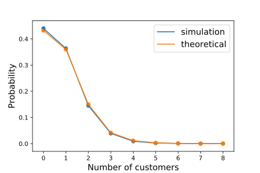

.. _processor-sharing:

=================================
How to Simulate Processor Sharing
=================================

Processor sharing is a service discipline where a number of customers are served simultaneously, with the 'service load' is equally shared between all customers that are receiving service. That is, the more customers there are receiving service, the slower service will be. This service speed is constantly updated throughout a customer's service to account for both new arrivals and customers leaving the node.

To implement this in Ciw, we make use of a different :code:`Node` class, using the argument :code:`node_class` when creating the simulation object. The required node class :code:`ciw.PSNode`.

Consider an Markovian queue with infinite process sharing capacity (this capacity is denoted by the :code:`number_of_servers` argument when creating the :code:`Network` object)::

    >>> import ciw
    >>> N = ciw.create_network(
    ...     arrival_distributions=[ciw.dists.Exponential(rate=4)],
    ...     service_distributions=[ciw.dists.Exponential(rate=9)],
    ...     number_of_servers=[float('inf')]
    ... )

Now we create a simulation object using :code:`ciw.PSNode` rather than :code:`ciw.Node`::
    
    >>> ciw.seed(0)
    >>> Q = ciw.Simulation(N, node_class=ciw.PSNode)

Note that this applies the process sharing node to every node of the network.
Alternatively we could provide a list of different node classes, for use on each different node of the network (see :ref:`this example <ps-routing>` for an in depth example of this)::

    >>> ciw.seed(0)
    >>> Q = ciw.Simulation(N, node_class=[ciw.PSNode])

Now let's run the simulation until 1000 customers have passed though::

    >>> Q.simulate_until_max_customers(1000)

Let's look at the average service time. Now, rather than an average service time of :math:`\frac{1}{\mu} = \frac{1}{9}` as we would expect in regular FIFO queues, we would now expect an average service time of :math:`\frac{1}{\mu - \lambda} = \frac{1}{9-4} = \frac{1}{5}`::

    >>> recs = Q.get_all_records()
    >>> services = [r.service_time for r in recs if r.arrival_date > 50]
    >>> sum(services) / len(services)
    0.1935655...

Though it looks like service times are much longer than in a regular FIFO queue, waiting times are non-existent here. It will have taken the exact same amount of time to process all 1000 customers in process sharing or in FIFO, as the process sharing discipline is work-conserving. Let's see::

    >>> ps_time_to_process_1000 = Q.current_time
    >>> ps_time_to_process_1000
    254.0556420...

    >>> ciw.seed(0) # same seed
    >>> Q = ciw.Simulation(N) # regular FIFO queue
    >>> Q.simulate_until_max_customers(1000)
    >>> fifo_time_to_process_1000 = Q.current_time
    >>> fifo_time_to_process_1000
    254.0556420...

In Ciw two different generalisations of processor sharing are available: limited processor sharing, and capacitated processor sharing, described below. Systems exhibiting both these behaviours simultaneously can be simulated.

Limited Process Sharing
-----------------------

A *limited processor sharing queue* ([JZ09]_) is a generalisation of a processor sharing queue, in which only a given number of customers may share the service load at any one time. This means that if there are more than that number of customers already present at the node, a newly arriving customer must wait in line in a FIFO manner until the number of customers sharing the service load drops below the given capacity.

With limited processor sharing queues, we can limit the sharing capacity.
This is done by setting a :code:`number_of_servers` in the network object.

Consider the same system, but a limit of 3 customers sharing the service load at a time::

    >>> N = ciw.create_network(
    ...     arrival_distributions=[ciw.dists.Exponential(rate=4)],
    ...     service_distributions=[ciw.dists.Exponential(rate=9)],
    ...     number_of_servers=[3]
    ... )
    >>> ciw.seed(0)
    >>> Q = ciw.Simulation(N, node_class=ciw.PSNode)
    >>> Q.simulate_until_max_customers(1000)

We can check the number of customers present at the node for those who had to wait and those who didn't::

    >>> recs = Q.get_all_records()
    >>> max([r.queue_size_at_arrival for r in recs if r.waiting_time == 0.0])
    2
    >>> min([r.queue_size_at_arrival for r in recs if r.waiting_time > 0.0])
    3

We see that every customer who had to wait did so because there was at least 3 other customers present in the node upon their arrival.

Capacitated Process Sharing
---------------------------

A *capacitated processor sharing queue*, or an R-PS queue ([XL09]_), is another generalisation of a processor sharing queue.
It has parameter :math:`R`, a threshold where if the number of customers exceeds it, service switches to processor sharing shared amongs :math:`R` processors. That is when there are :math:`R` or less customers, each customer is served independently with rate 1; when there are :math:`n > R` customers, each customer is served with rate :math:`R/n`.

With capacitated processor sharing queues, we can set the threshold :math:`R` by setting a :code:`ps_threshold` in the network object.

Consider the another system, but with threshold of 3 customers before processor sharing is required::

    >>> N = ciw.create_network(
    ...     arrival_distributions=[ciw.dists.Exponential(rate=10)],
    ...     service_distributions=[ciw.dists.Exponential(rate=12)],
    ...     number_of_servers=[float('inf')],
    ...     ps_thresholds=[3]
    ... )
    >>> ciw.seed(0)
    >>> Q = ciw.Simulation(N, node_class=ciw.PSNode,
    ...     tracker=ciw.trackers.SystemPopulation())
    >>> Q.simulate_until_max_time(1000)

A state tracker was added so that the state distribution can be compared to theory::

    >>> Q.statetracker.state_probabilities(observation_period=(100, 900)) # doctest:+SKIP
    {0: 0.4398895319845431,
     1: 0.36347562618363427,
     2: 0.14507848814897362,
     3: 0.03916266222272885,
     4: 0.009173532615323427,
     5: 0.0021859853488494707,
     6: 0.0008073744011269568,
     7: 9.470825328580901e-05,
     8: 0.00013209084153452012}

In [XL09]_ theoretical results are given for these probabilities by:

.. math::
    p(j) = \begin{cases}
            \frac{(1-\rho)\frac{R!}{j!}(R\rho)^{j-R}E_2(R,R\rho)}{1-E_2(R,R\rho) \rho^{N-R}\rho}, & j <R\\
            \frac{E_2(R,R\rho)\rho^{j-R}(1-\rho)}{1-E_2(R,R\rho)\rho^{N-R}\rho}, & N\ge j \ge R
        \end{cases}

where :math:`R` is the process sharing capacity, :math:`\rho = \frac{\lambda}{R\mu}` is the traffic intensity, and :math:`E_2` is the Erlang function is given by:

.. math::
    E_2(R, A) = \frac{
    \frac{A^R}{R!} \cdot \frac{R}{R-A}
    }{
    \left(\frac{A^R}{R!} \cdot \frac{R}{R-A}\right) + \sum_{i=0}^{R-1}\frac{A^i}{i!}
    }

Plotting these theoretical results against a single run of our simulation shows a good alignment:

