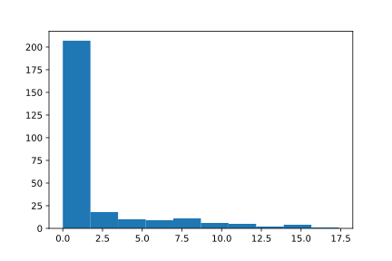

.. _tutorial-iii:

================================
Tutorial III: Collecting Results
================================

In the previous tutorials, we defined and simulated our bank for a week, and saw how to access parts of the simulation engine::

    >>> import ciw
    >>> N = ciw.create_network(
    ...     arrival_distributions=[ciw.dists.Exponential(rate=0.2)],
    ...     service_distributions=[ciw.dists.Exponential(rate=0.1)],
    ...     number_of_servers=[3]
    ... )
    >>> ciw.seed(1)
    >>> Q = ciw.Simulation(N)
    >>> Q.simulate_until_max_time(1440)

We can quickly get a list of all data records collected by all customers have have finished at least one service, using the :code:`get_all_records` method of the Simulation object::

    >>> recs = Q.get_all_records()

This returns a list of named tuples. Each named tuple contains the following information:

    - :code:`id_number`
    - :code:`customer_class`
    - :code:`node`
    - :code:`arrival_date`
    - :code:`waiting_time`
    - :code:`service_start_date`
    - :code:`service_time`
    - :code:`service_end_date`
    - :code:`time_blocked`
    - :code:`exit_date`
    - :code:`destination`
    - :code:`queue_size_at_arrival`
    - :code:`queue_size_at_departure`
    - :code:`server_id`
    - :code: `record_type`

More information on each of these is given in :ref:`refs-results`.

Using list comprehension, we can get lists on whichever statistic we like::

    >>> # A list of service times
    >>> servicetimes = [r.service_time for r in recs]
    >>> servicetimes
    [2.94463..., 5.96912..., 18.80156..., ..., 33.18376...]

    >>> # A list of waits
    >>> waits = [r.waiting_time for r in recs]
    >>> waits
    [0.0, 0.0, 0.0, 0.20439..., ..., 0.0]

Now we can get summary statistics simply by manipulating these lists::

    >>> mean_service_time = sum(servicetimes) / len(servicetimes)
    >>> mean_service_time
    10.647482...

    >>> mean_waiting_time = sum(waits) / len(waits)
    >>> mean_waiting_time
    4.230543...

We now know the mean waiting time of the customers!
In next tutorial we will show how to get more representative results (as we have only simulated one given day here).

Further summary statistics can be obtained using external libraries.
We recommend `numpy <http://www.numpy.org/>`_, `pandas <http://pandas.pydata.org/>`_ and `matplotlib <http://matplotlib.org/>`_. 
Using these further statistics and plots can be explored.
The histogram of waits below was created using matplotlib, using the following code::

    >>> import matplotlib.pyplot as plt # doctest:+SKIP
    >>> plt.hist(waits); # doctest:+SKIP

If we'd like to see how busy or idle the servers have been throughout the simulation run, we can look at the :code:`server_utilisation` of a Node.
This is the average utilisation of each server, which is the amount of time a server was busy (with a customer), divided by the total amount of time the server was on duty::

    >>> Q.transitive_nodes[0].server_utilisation
    0.75288...

Thus in our bank, on average the servers were busy 75.3% of the time.

The next tutorial will show how to use Ciw to get trustworthy results, and finally find out the average waiting time at the bank.